# Diagrams Extract with YOLOv4 Computer Vision 🌟

## The Challenge
In today's fast-paced digital world, automation is the key to efficiency. Educational institutions have moved their operations online, making many tasks more accessible. However, when it comes to creating assignments or questions based on **diagrams**, we face a unique challenge.

## The Solution: Enter the Magic of Deep Learning & Computer Vision
🚀 Say hello to our solution: A Custom Object Detector powered by the mighty YOLOv4 object detection model and Darknet.

## The Tech Behind the Curtain
🧪 We wield the power of:
- Python
- OpenCV
- YOLOv4
- Darknet

## Supercharge Your Project with External Help
💪 For a dynamic duo, we team up with:
- Google Colab
- [LabelImg](https://github.com/tzutalin/labelImg) for image labeling

## Unveiling the Model Training Process
1. 🏷️ **Fifty handpicked images** were meticulously labeled using LabelImg, forming the cornerstone of our training dataset.
2. We created a class named **'object'** to identify diagrams within the images.
3. The model underwent rigorous training, with the action happening in the world of Google Colab. You can find all the secrets of our training in this [Colab File](https://colab.research.google.com/drive/1OA_iwX2PsMf0gyXtuGiTIGuVb0PzhMNF?usp=sharing).
4. For the nitty-gritty training configuration, hop over to the Colab File.

## Let's Put It to the Test!
1. Our trained model was put through the paces with a set of **seven test images** that were kept completely separate from the training data.

## The Grand Reveal: Behold the Results

### 🌠 Result 1
**Input**
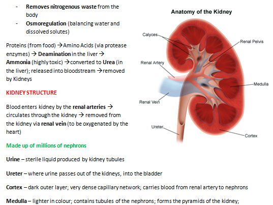

**Output**
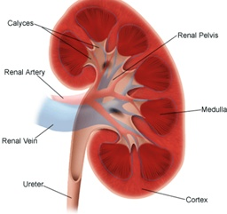

### 🌠 Result 2
**Input**
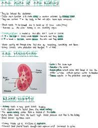

**Output**
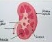

### 🌠 Result 3
**Input**
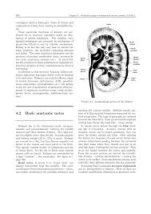

**Output**
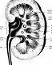

### 🚫 Result 4
**Input**
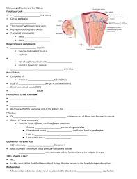

**Output**
No detection.

### 🌠 Result 5
**Input**

**Output**

### 🌠 Result 6
**Input**
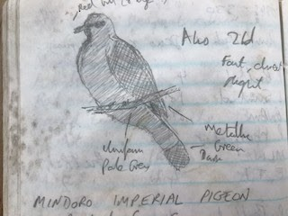

**Output**
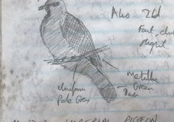

### 🌠 Result 7
**Input**
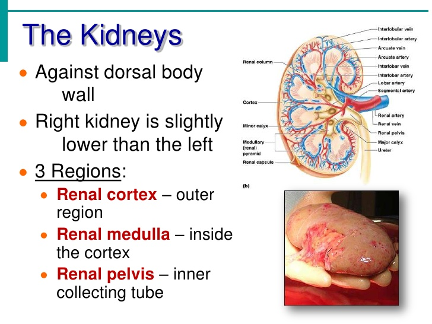

**Output**
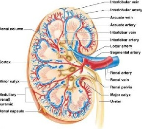
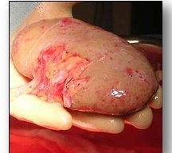

## Challenges We Triumphed Over
1. 💫 Dealing with Skewed Images: We wielded the power of OpenCV to rectify these issues.
2. 🖼️ Low-Resolution Images: Better training data was our secret weapon.
3. 🌒 Shadows & Image Imperfections: We improved training with diverse images and plan for manual intervention in edge cases.
4. ✂️ Cut-Out Text: A dedicated class for cut-out text detection ensures precise results.

## Join the Vision Quest
🌟 Unleash the power of Computer Vision and make your projects come to life.
